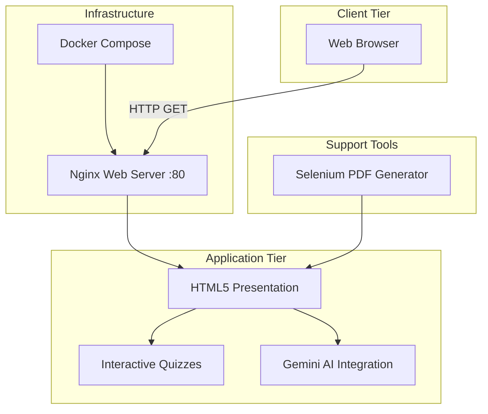

# EOIC (Enterprise Optimized Interactive Content)

This repository adopts strict enterprise engineering standards, focusing on resilient architecture, graceful error handling, and robust continuous integration.

## 🏗️ System Architecture



## 🛠️ Step-by-Step Setup

Follow these instructions to get the application up and running locally.

### Prerequisites

- [Docker](https://www.docker.com/) and [Docker Compose](https://docs.docker.com/compose/) installed on your machine.
- Python 3.11 (if you intend to use the PDF generation tools).

### Running the Application

1. **Start the containers** using Docker Compose. This will build the robust Nginx container and mount the source code:
   ```bash
   docker-compose up --build -d
   ```

2. **Verify Health**:
   The container includes a robust healthcheck mechanism. Ensure it is healthy by running:
   ```bash
   docker ps
   ```

3. **Access the Application**:
   Open your browser and navigate to [http://localhost:8080](http://localhost:8080).

4. **Stop the Application**:
   ```bash
   docker-compose down
   ```

## 📦 Dependency Rationale

- **Nginx (alpine)**: Chosen for its incredibly small footprint, high performance, and security. We use it to serve the static assets rapidly.
- **Docker & Docker Compose**: Ensures that the application runs identically in development, testing, and production environments, eliminating the "works on my machine" syndrome.
- **Selenium & img2pdf (Python)**: Used exclusively for offline operations (converting the dynamic presentation into static PDF documents). Selenium provides a real headless browser context to capture animations/rendering precisely.
- **TailwindCSS**: Utilitarian styling framework that allows rapid, maintainable design iteration directly within the HTML.

## 📂 Structure

- `/src/` - The main application code and visual assets.
- `/tests/` - Unit tests ensuring operational stability.
- `.github/workflows/` - Continuous Integration pipelines enforcing code quality on every push.